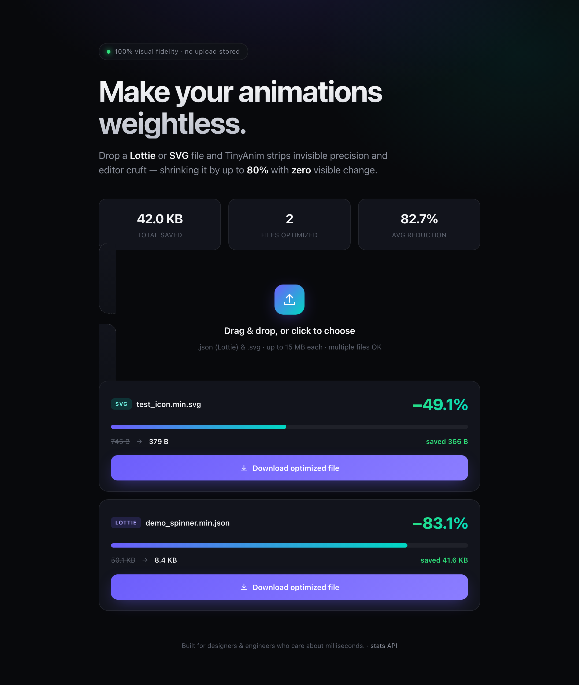

# TinyAnim ✨

**Make every asset weightless — Lottie, SVG & images.**

TinyAnim shrinks your assets dramatically while keeping them looking great:

- **Lottie (JSON) & SVG — losslessly, up to 80%.** It discards only what the
  renderer never uses: excess float precision on coordinates/tangents/time,
  authoring metadata (AE layer names, editor namespaces, comments, unreferenced
  `id`s, `xml:space`, `data-*`), and verbose formatting. Pixels are identical.
- **Images (JPG, PNG, HEIC, AVIF, WebP, …) — smart compression, often up to
  ~90%.** Photos are re-encoded to the smallest modern codec (AVIF/WebP),
  whichever wins, never larger than the original. This step is *lossy* (the
  pixels are re-encoded) but tuned to be visually near-identical.

A solid, Apple/Vercel-grade dark UI lets you drag & drop files and instantly see
the before/after size, reduction percentage and a glowing download button.

<p align="center">
  
</p>

---

## Features

**Compression core**
- **Lottie Optimizer** — recursive float rounding, metadata (`nm`/`mn`/`meta`)
  stripping, and compact JSON re-serialization.
- **SVG Optimizer** — editor-namespace & comment removal, unreferenced-`id`
  pruning, path-data (`d`) number rounding + whitespace minification.
- **Visually lossless & pure Python** — the optimizer has zero heavy
  dependencies, so it is trivially testable and embeddable.

**SaaS platform**
- **Passwordless auth** — magic-link sign-in (no passwords stored). Works in a
  zero-config "dev mode" locally; uses [Resend](https://resend.com) for real
  email delivery in production.
- **Stripe subscriptions** — Free vs. Pro plans with Checkout, the customer
  Billing Portal, and webhook-driven state reconciliation.
- **Usage gating** — rolling 30-day quota and per-plan file-size limits enforced
  server-side.
- **Programmatic API** — Pro users mint API keys for `Authorization: Bearer`
  access to `/api/optimize`.
- **Production-grade safety** — strict extension allow-list, content sniffing,
  streamed size-capped uploads (no memory blow-ups), and an in-memory TTL
  download store — uploads are **never written to disk**.

### Plans

| Plan | Price | Quota | Max file | Batch | API |
| ---- | ----- | ----- | -------- | ----- | --- |
| Free | $0 | 20 files / 30 days | 5 MB | – | – |
| Pro  | $9/mo | Unlimited | 50 MB | ✓ | ✓ |

---

## Quick start (local, zero config)

```bash
python3 -m venv .venv
source .venv/bin/activate
pip install -r requirements.txt

uvicorn app.main:app --reload
```

Open <http://127.0.0.1:8000>. With no env vars set, the app runs against SQLite
and prints magic-link sign-in URLs to the server log (no email/Stripe needed) so
you can exercise the whole flow locally. Copy [.env.example](.env.example) to
`.env` to configure email and billing.

---

## Deploy as a public website (Render)

The repo ships a [`render.yaml`](render.yaml) blueprint (web service + managed
Postgres):

1. Push this repo to GitHub.
2. On [Render](https://render.com): **New → Blueprint**, select the repo. Render
   provisions the web service and database from `render.yaml`.
3. After the first deploy, set `TINYANIM_BASE_URL` to your Render URL
   (e.g. `https://tinyanim.onrender.com`).
4. **Email** (optional, for real magic links): set `RESEND_API_KEY` and
   `TINYANIM_EMAIL_FROM`.
5. **Billing**: create the Pro price (`python scripts/stripe_bootstrap.py` with a
   `sk_test_…` key), then set `STRIPE_SECRET_KEY`, `STRIPE_PRICE_ID`,
   `STRIPE_PUBLISHABLE_KEY`, and `STRIPE_WEBHOOK_SECRET` (point a Stripe webhook
   at `/billing/webhook`). Start in **test mode**, switch to live keys when ready.

---

## Project layout

```
app/
  main.py          FastAPI app, routes, upload security, download store
  optimizer.py     Lottie & SVG compression engines (pure Python)
  auth.py          Passwordless magic-link auth + sessions
  billing.py       Stripe subscriptions (checkout, portal, webhooks)
  plans.py         Plan definitions & gating rules
  config.py        Env-driven settings
  database.py      SQLite (local) / Postgres (prod) session management
  models.py        ORM models + persistence helpers
  templates/       base / index / login / account (dark-mode UI)
scripts/
  stripe_bootstrap.py   One-shot Pro product/price creator
render.yaml        One-click Render blueprint (web + Postgres)
.env.example       All configuration documented
requirements.txt
README.md
```

---

## API

| Method | Path                  | Auth        | Description                                |
| ------ | --------------------- | ----------- | ------------------------------------------ |
| `GET`  | `/`                   | –           | Landing page (UI + lifetime stats)         |
| `GET`  | `/login`              | –           | Magic-link sign-in page                    |
| `POST` | `/auth/request`       | –           | Email a sign-in link                       |
| `GET`  | `/auth/verify`        | token       | Verify link → set session cookie           |
| `GET`  | `/account`            | session     | Plan, usage, API keys, billing             |
| `POST` | `/billing/checkout`   | session     | Start Pro subscription (Stripe Checkout)   |
| `POST` | `/billing/portal`     | session     | Manage/cancel subscription                 |
| `POST` | `/billing/webhook`    | Stripe sig  | Subscription state reconciliation          |
| `POST` | `/api/keys`           | session/Pro | Generate a programmatic API key            |
| `POST` | `/api/optimize`       | session/key | Optimize one uploaded file → JSON + token  |
| `GET`  | `/api/download/{tok}` | –           | Download a previously optimized payload    |
| `GET`  | `/api/stats`          | –           | Lifetime aggregate statistics (JSON)       |
| `GET`  | `/healthz`            | –           | Liveness probe                             |

### Programmatic example (Pro)

```bash
curl -H "Authorization: Bearer ta_your_key" \
     -F "file=@animation.json" \
     https://your-tinyanim.example.com/api/optimize
```

```json
{
  "kind": "lottie",
  "output_filename": "animation.min.json",
  "original_size": 84210,
  "optimized_size": 19877,
  "saved_bytes": 64333,
  "reduction_percent": 76.4,
  "download_token": "…"
}
```

---

## Configuration (env vars)

See [.env.example](.env.example) for the full list. The essentials:

| Variable                 | Required          | Purpose                                   |
| ------------------------ | ----------------- | ----------------------------------------- |
| `TINYANIM_SECRET_KEY`    | prod              | Signs cookies & magic-link tokens         |
| `TINYANIM_BASE_URL`      | prod              | Public URL for links & Stripe redirects   |
| `TINYANIM_COOKIE_SECURE` | prod              | `true` behind HTTPS                        |
| `DATABASE_URL`           | prod              | Postgres URL (defaults to local SQLite)   |
| `RESEND_API_KEY`         | for real email    | Enables magic-link email delivery         |
| `STRIPE_SECRET_KEY`      | for billing       | Stripe API key (`sk_test_…` to start)     |
| `STRIPE_PRICE_ID`        | for billing       | The Pro recurring price                   |
| `STRIPE_WEBHOOK_SECRET`  | for billing       | Verifies incoming Stripe webhooks         |

Anything unset degrades gracefully: no Stripe keys → upgrades are hidden; no
Resend key → magic links are logged instead of emailed.

---

## How the compression stays lossless

Lottie players and SVG renderers rasterize at device pixel resolution. A
coordinate like `123.456789123` and `123.46` produce **identical pixels** on any
real display, so the extra digits are pure payload. Likewise, `nm` layer names,
editor namespaces and comments are ignored at render time. TinyAnim removes only
this redundant data — it never alters geometry, colors, timing curves or
structure.

---

## License

MIT.
